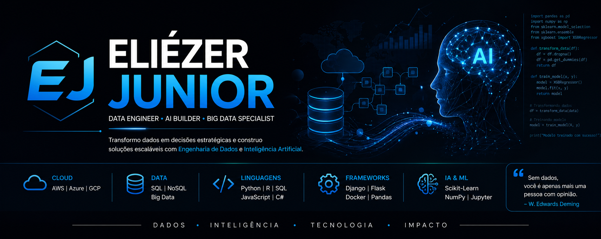

<!-- BANNER -->
<h1 align="center">🚀 Eliézer Junior</h1>

  

  

  <b>Data Analytics Engineer | AI Builder | Big Data Specialist</b>

  <i>Transformando dados em decisões estratégicas com Engenharia, Análise de Dados e Inteligência Artificial</i>

 
  
  
  

---

## 🎓 Formação

* 🎓 Física
* 🎓 Banco de Dados
* 🎓 Pós-graduação em Ciência de Dados
* 🎓 Pós-graduação em Inteligência Artificial — ICMC/USP (em andamento)

---

## 🧠 Sobre mim

Sou Analista de Dados com forte atuação em Engenharia de Dados e Inteligência Artificial, focado em construir soluções escaláveis que transformam dados em valor real para o negócio.
 Atuo com pipelines de dados, arquitetura escalável e aplicações orientadas a IA.
 🎯 **Objetivo:** evoluir para construção de sistemas autônomos baseados em agentes inteligentes e LLMs.
 

## 🛠️ Tech Stack

### ☁️ Cloud
AWS • Azure • GCP

### 🗄️ Data
SQL Server • MySQL • Oracle • MongoDB

### 🧠 Linguagens
Python • R • JavaScript • C#

### ⚙️ Frameworks & Tools
Django • Flask • Docker • Pandas • NumPy • Scikit-Learn

### 💻 Ambiente
VS Code • PyCharm • Jupyter

---

  <i>"Sem dados, você é apenas mais uma pessoa com opinião."</i> 
  <b>— W. Edwards Deming</b>

